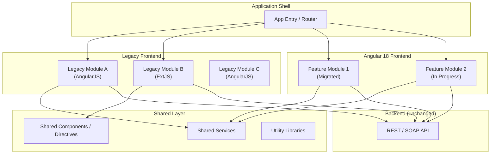
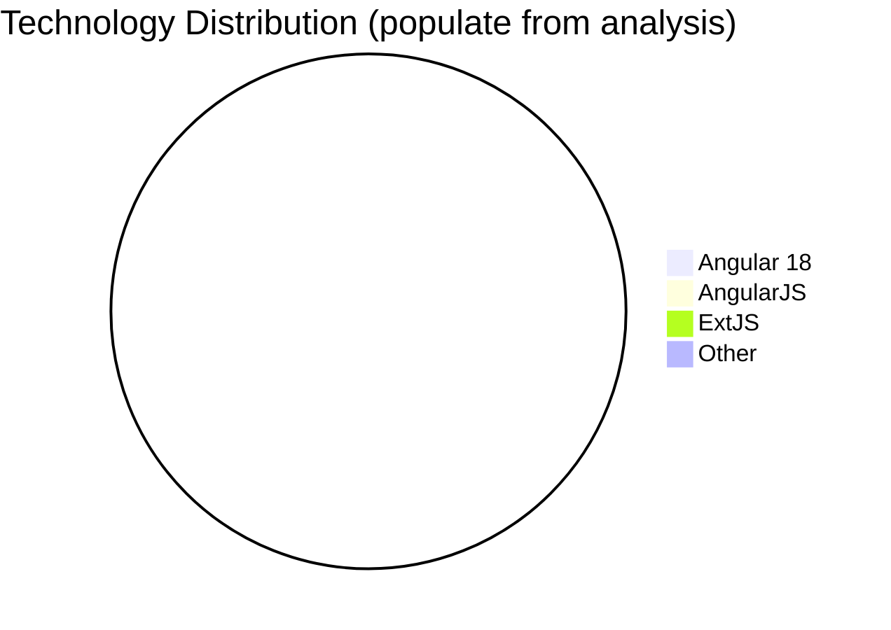

# Application Landscape

> **Document type:** Knowledge Layer — living inventory and migration dashboard  
> **Last refreshed:** _Not yet populated — run repository analysis to generate_  
> **Refresh cadence:** After each migrated feature, at milestone boundaries, or when legacy modules are added or retired

---

## Purpose

This document provides a **visual and technical overview of the current application landscape**. It is the **source of truth for understanding the current state** of the application — what exists, how it is built, and how far modernization has progressed.

For migration and modernization projects, this document is **mandatory reading before** `knowledge/migration-strategy.md`, `plan.md`, or feature-level documentation.

| Document | Role |
|----------|------|
| `knowledge/application-landscape.md` | **What exists today** — inventory, distribution, progress |
| `knowledge/migration-strategy.md` | **How to migrate** — approach, constraints, module mapping |
| `plan.md` | **What to build** — product scope and milestones |
| `progress.md` | **What is done** — current milestone status |

---

## How to Generate and Refresh

This document should be **generated and periodically refreshed by analyzing the source repository**. AI assistants and developers should update it when:

- A feature or module is migrated, started, or retired
- A milestone completes
- New legacy or Angular modules are discovered
- Technical debt hotspots are identified or resolved

### Recommended analysis steps

1. **Scan source tree** — inventory all frontend folders, entry points, and build configs
2. **Detect frameworks** — search for AngularJS (`angular.module`), ExtJS (`Ext.define`), jQuery patterns, Angular (`@Component`)
3. **Inventory routes** — parse legacy route configs and Angular `Routes` definitions
4. **Count components** — directives, controllers, ExtJS widgets, Angular components
5. **Map features** — cross-reference with `features/` documentation and module mapping in `migration-strategy.md`
6. **Update dashboards** — recalculate migration percentages and status tables
7. **Set `Last refreshed`** — record date and brief summary of changes

### Detection signals (examples)

| Framework | Search patterns |
|-----------|----------------|
| Angular 18 | `@Component`, `standalone: true`, `bootstrapApplication` |
| AngularJS | `angular.module`, `.controller(`, `.directive(`, `$routeProvider` |
| ExtJS | `Ext.define`, `Ext.application`, `xtype:` |
| jQuery | `$(`, `jQuery`, legacy DOM manipulation without framework |
| React / Vue | `createRoot`, `Vue.createApp` (if present in hybrid repos) |

---

# High-Level Application Overview

> _Populate by analyzing the repository._

| Attribute | Value |
|-----------|-------|
| Application name | _TBD_ |
| Repository path | _TBD_ |
| Application type | _e.g. SPA, MPA, hybrid shell, embedded widgets_ |
| Primary users | _TBD_ |
| Deployment target | _e.g. on-prem Tomcat, CDN, GitHub Pages, IIS_ |
| Backend coupling | _e.g. REST API, SOAP, server-rendered pages, none_ |
| Migration target | Angular 18 (standalone components, Angular Material) |
| Overall migration status | _e.g. Not started / In progress / Complete_ |

### Summary narrative

_Describe in 2–4 sentences what the application does, its primary technology mix, and the current modernization posture._

---

# Migration Dashboard

> _Recalculate whenever modules, components, or features change status._

## Module summary

| Metric | Count |
|--------|------:|
| **Total modules** | _X_ |
| **Migrated modules** | _X_ |
| **In-progress modules** | _X_ |
| **Remaining modules** | _X_ |
| **Migration percentage** | _X%_ |

## Technology distribution

| Technology | Modules | Percentage |
|------------|--------:|-----------:|
| **Angular 18** | _X_ | _X%_ |
| **AngularJS** | _X_ | _X%_ |
| **ExtJS** | _X_ | _X%_ |
| **jQuery / vanilla JS** | _X_ | _X%_ |
| **Other** | _X_ | _X%_ |

## Component summary

| Metric | Count |
|--------|------:|
| **Total components** | _X_ |
| **Migrated components** | _X_ |
| **In-progress components** | _X_ |
| **Remaining components** | _X_ |
| **Component migration percentage** | _X%_ |

## Feature summary

| Metric | Count |
|--------|------:|
| **Total features** | _X_ |
| **Migrated features** | _X_ |
| **In-progress features** | _X_ |
| **Remaining features** | _X_ |
| **Feature migration percentage** | _X%_ |

---

# Visual Application Map

> _Replace placeholder diagram with actual module relationships after repository analysis._

## Module relationship diagram

## Technology coexistence diagram

_Update pie chart values when refreshing this document._

---

# Route and Module Inventory

> _Inventory all routes and the modules that own them._

## Route inventory

| Route / URL pattern | Owning module | Framework | Migration status | Target Angular route |
|--------------------|---------------|-----------|------------------|---------------------|
| _e.g. `#/dashboard`_ | _dashboardModule_ | AngularJS | Remaining | _/dashboard_ |
| _e.g. `#/reports/list`_ | _reportsModule_ | ExtJS | In progress | _/reports_ |
| _e.g. `/app/customers`_ | _customersFeature_ | Angular 18 | Complete | _/customers_ |

**Status values:** `Complete` · `In progress` · `Remaining` · `Legacy retired`

## Module inventory

| Module name | Path | Framework | Type | Dependencies | Migration status |
|-------------|------|-----------|------|--------------|------------------|
| _TBD_ | _TBD_ | _AngularJS / ExtJS / Angular 18_ | _Feature / Shared / Shell_ | _TBD_ | _TBD_ |

---

# Shared Libraries and Component Libraries

> _Document reusable assets that span modules._

## Shared libraries

| Library | Location | Framework | Consumed by | Migration plan |
|---------|----------|-----------|-------------|----------------|
| _e.g. date-utils_ | _shared/utils/_ | JavaScript | _12 modules_ | _Replace with Angular pipe_ |
| _e.g. http-interceptor_ | _shared/services/_ | AngularJS | _Global_ | _Port to HttpInterceptor_ |

## Component libraries

| Library / package | Location | Framework | Components | Migration plan |
|-------------------|----------|-----------|------------|----------------|
| _e.g. ui-grid wrappers_ | _shared/directives/_ | AngularJS | _5 directives_ | _Replace with Material table_ |
| _e.g. ExtJS theme widgets_ | _ext/custom/_ | ExtJS | _8 xtypes_ | _Replace with Material components_ |

## Third-party dependencies

| Package | Version | Used by | Replacement (if any) |
|---------|---------|---------|---------------------|
| _TBD_ | _TBD_ | _TBD_ | _TBD_ |

---

# Legacy Framework Usage

> _Quantify and locate legacy framework code._

## AngularJS

| Metric | Value |
|--------|-------|
| Modules (`angular.module`) | _X_ |
| Controllers | _X_ |
| Directives | _X_ |
| Services / factories | _X_ |
| Templates (HTML) | _X_ |
| Primary locations | _TBD_ |

## ExtJS

| Metric | Value |
|--------|-------|
| Classes (`Ext.define`) | _X_ |
    |
| xtypes | _X_ |
| Stores | _X_ |
| Views / panels | _X_ |
| Primary locations | _TBD_ |

## Other legacy patterns

| Pattern | Count | Locations | Notes |
|---------|------:|-----------|-------|
| jQuery DOM manipulation | _X_ | _TBD_ | _TBD_ |
| Global script tags | _X_ | _TBD_ | _TBD_ |
| Inline event handlers | _X_ | _TBD_ | _TBD_ |

---

# Migration Status

## Angular migration status (by module)

| Module | Framework (current) | Target feature | Status | Notes |
|--------|--------------------|--------------------|--------|-------|
| _TBD_ | _AngularJS_ | _features/..._ | _Pending / In progress / Complete_ | _TBD_ |

## Component migration status

| Component (legacy) | Type | Target Angular component | Status | Blockers |
|--------------------|------|--------------------------|--------|----------|
| _TBD_ | _directive / controller / xtype_ | _TBD_ | _TBD_ | _TBD_ |

## Feature migration status

| Feature | Legacy modules | Angular location | Status | Milestone |
|---------|---------------|------------------|--------|-----------|
| _TBD_ | _TBD_ | _frontend/src/app/features/..._ | _Pending / In progress / Complete_ | _TBD_ |

**Cross-reference:** Module mapping details live in `knowledge/migration-strategy.md`.

---

# Known Technical Debt and Hotspots

> _Prioritize areas that block or complicate migration._

| Hotspot | Location | Severity | Impact on migration | Recommended action |
|---------|----------|----------|--------------------|--------------------|
| _e.g. God controller_ | _app/modules/core/mainCtrl.js_ | High | _Blocks feature split_ | _Extract services first_ |
| _e.g. Shared global state_ | _window.AppState_ | High | _Prevents component isolation_ | _Introduce service abstraction_ |
| _e.g. No unit tests_ | _reports module_ | Medium | _No safety net for rewrite_ | _Add E2E before migration_ |
| _e.g. Tight API coupling in views_ | _multiple templates_ | Medium | _UI knows response shape_ | _Define DTOs in service layer_ |

### Debt categories to watch

- **Global dependencies** — `$`, `Ext`, `angular` on `window`
- **Tight coupling** — components calling HTTP directly; business logic in controllers
- **Missing tests** — modules with no unit or E2E coverage
- **Undocumented APIs** — implicit response shapes not in `api-contracts.md`
- **Build fragility** — manual script ordering, no tree-shaking
- **Browser constraints** — legacy browser support limiting Material usage

---

# Refresh Log

| Date | Refreshed by | Summary of changes |
|------|--------------|-------------------|
| _TBD_ | _AI / developer_ | _Initial repository analysis_ |

---

## Related Documents

| Document | When to read |
|----------|--------------|
| `knowledge/application-landscape.md` | **First** — current state and migration progress (this document) |
| `knowledge/migration-strategy.md` | **Second** — migration approach and module mapping |
| `plan.md` | **Third** — product scope and milestones |
| `progress.md` | **Fourth** — milestone status |
| `features/<feature>/` | **Fifth** — feature-level context when applicable |
| `knowledge/architecture/api-contracts.md` | When analyzing API coupling or service abstraction |
