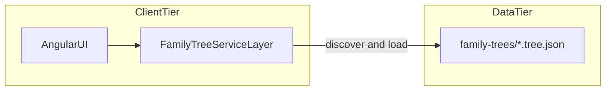
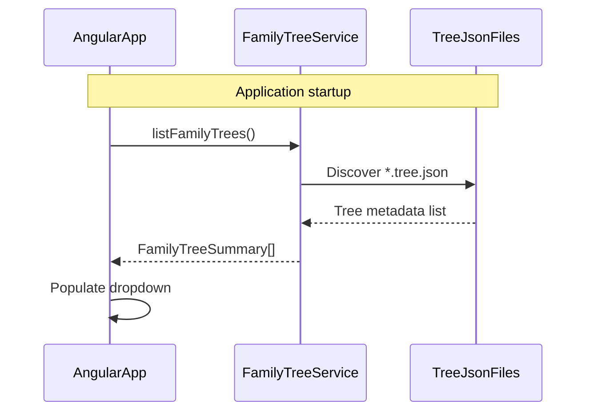
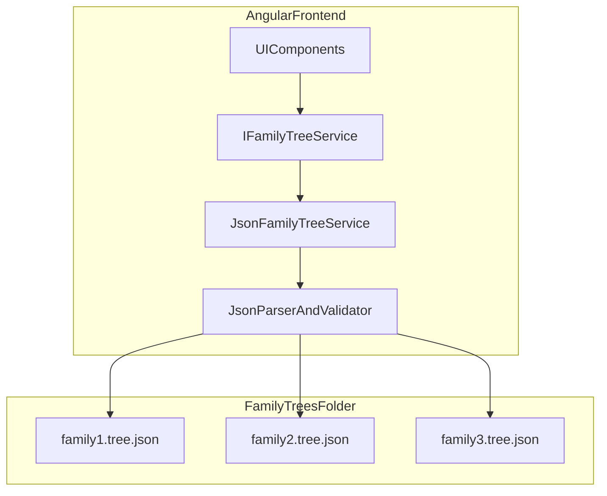
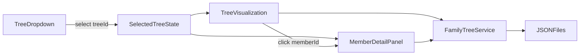

# Integration Diagrams

How the Family Tree application components integrate in V1.

**Source of truth:** [architecture-decisions.md](../architecture-decisions.md), [api-contracts.md](api-contracts.md), [coding-standards.md](../coding-standards.md)

---

## Runtime integration overview (V1)

V1 has no server tier. The Angular app loads bundled JSON through injectable services. There is no login screen.

---

## UI ↔ Service layer integration

| Concern | Integration |
|---------|-------------|
| Entry point | Main view with tree dropdown (no login screen) |
| Data access | Components call `IFamilyTreeService` (or equivalent abstraction) |
| V1 implementation | `JsonFamilyTreeService` reads `family-trees/*.tree.json` |
| Discovery | Service scans available tree files at startup |
| Selection | Dropdown lists all bundled trees; selection triggers `getFamilyTree(id)` and `getMembers(treeId)` |
| Errors | Invalid JSON skipped or surfaced as user-friendly error; missing tree shows empty state |

---

## Service layer ↔ JSON data integration

The service layer is the sole owner of JSON access. UI components never import tree files directly.

**Responsibilities:**

- **UI components** — render trees and member details; call service methods only
- **Service interface** — read-only contract for list, get tree, get members, get member detail
- **JSON implementation** — file discovery, fetch/parse, domain validation at load time
- **JSON files** — static read-only data conforming to [api-contracts.md](api-contracts.md)

---

## Tree selection integration

All trees in the dropdown are publicly viewable. Selection is a UI state change only — no access checks.

---

## Deployment integration (V1)

| Component | Target | Notes |
|-----------|--------|-------|
| Frontend | Vercel | Static/hosted Angular build |
| Family tree JSON | Bundled with frontend | `family-trees/` included as build assets |

No backend, API base URL, or secrets configuration is needed for V1.

---

## Testing integration

| Layer | Tool | Integration point |
|-------|------|-------------------|
| Frontend unit | Angular test framework | Components, services, JSON parsing |
| Frontend E2E | Playwright | Browser → dropdown → tree view → member detail |

Service layer tests should mock JSON responses or use fixture files under `family-trees/` for deterministic tests.
