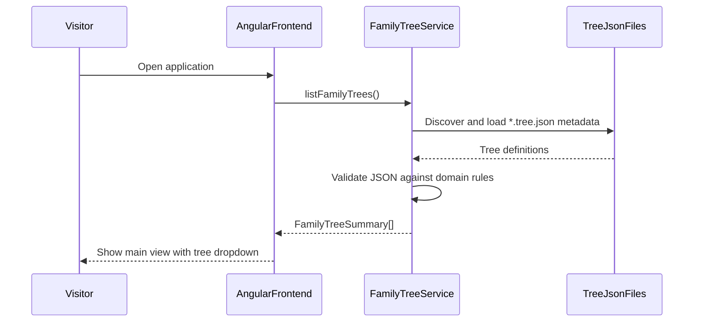
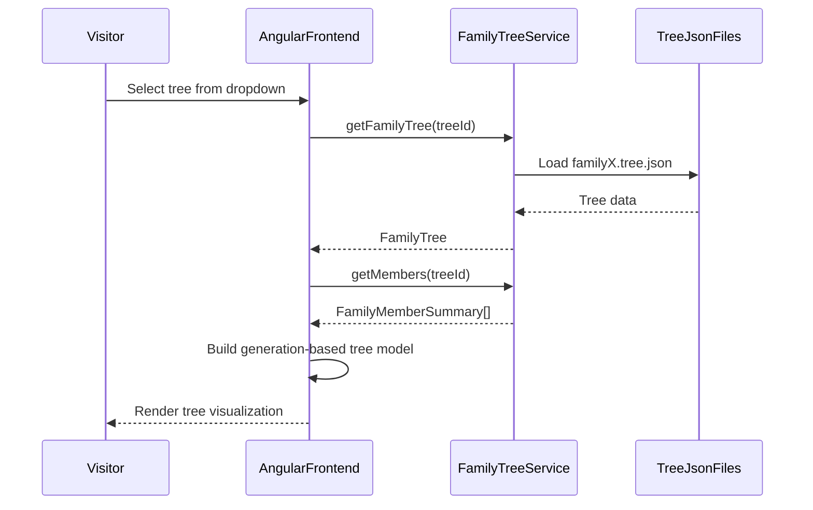
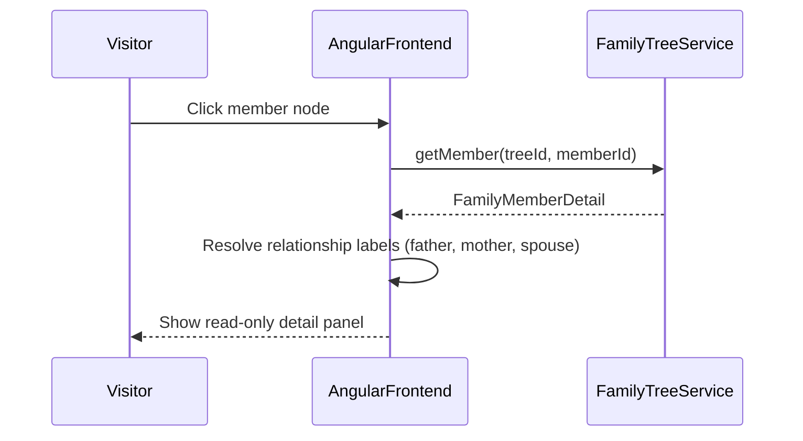
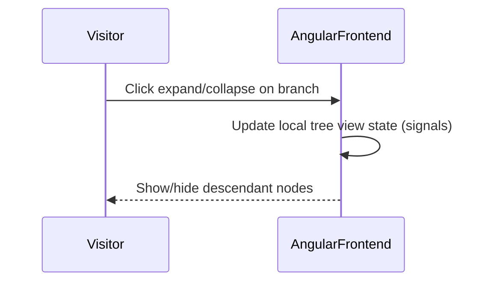
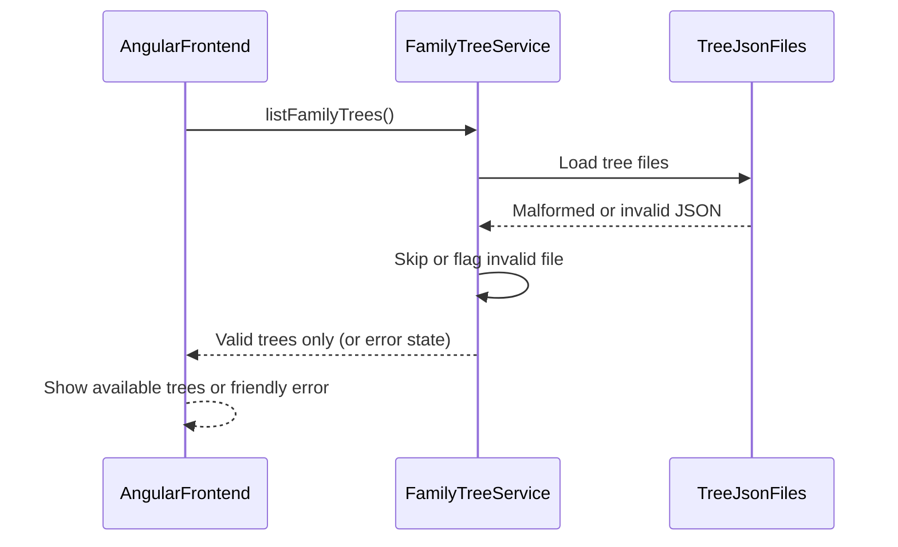

# Sequence Diagrams

Key interaction flows for the Family Tree application (V1).

**Source of truth:** [plan.md](../../plan.md), [api-contracts.md](api-contracts.md), [domain-rules.md](../domain-rules.md)

---

## Application startup and tree discovery

On load, the application discovers available family trees and populates the dropdown. The visitor lands directly on the main view — there is no login screen.

---

## Select and render family tree

The visitor selects any available tree from the dropdown. The service loads members and the UI renders the visualization.

---

## View member details (read-only)

---

## Expand and collapse tree branches

No service call is required — branch state is a UI concern.

---

## Invalid or missing tree data

