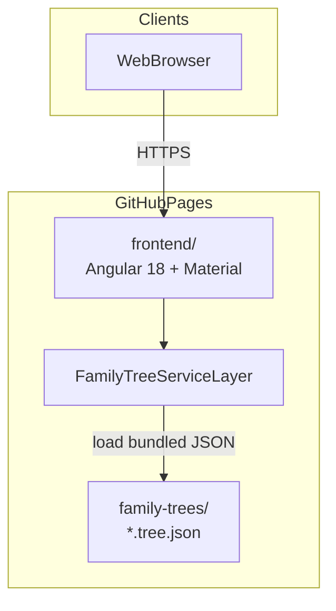
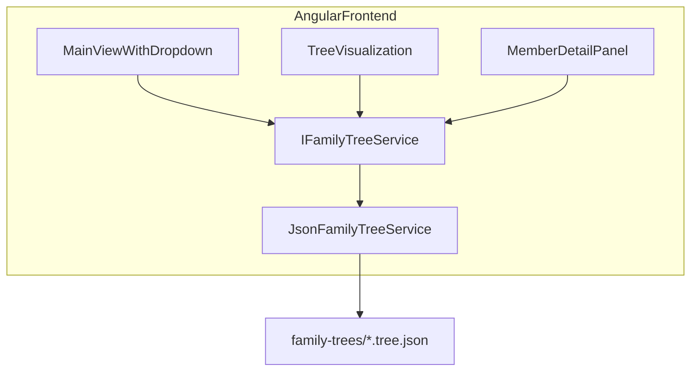
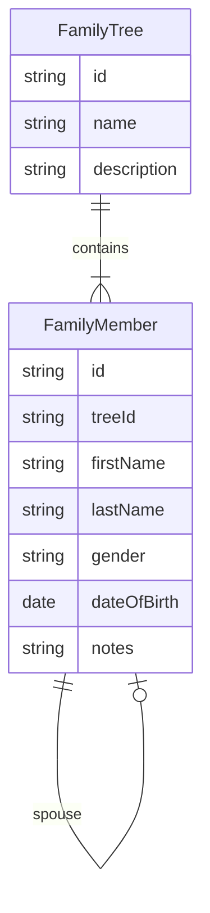

# System Diagrams

High-level system view for the Family Tree application (V1).

**Source of truth:** [plan.md](../../plan.md), [architecture-decisions.md](../architecture-decisions.md), [coding-standards.md](../coding-standards.md)

---

## System context

Version 1 is a public, read-only family tree viewer. Any visitor uses a browser to explore pre-defined family trees. The app opens directly to tree selection — there is no login screen and no backend.

---

## Container diagram

Frontend-only deployment. The Angular application is hosted on GitHub Pages. Family tree data is bundled as JSON files loaded through a service abstraction layer.

### Containers

| Container | Technology | Responsibility |
|-----------|------------|----------------|
| **Web Browser** | — | Renders UI; visitor selects and explores family trees |
| **Frontend** (`frontend/`) | Angular 18, TypeScript, Angular Material | Main view with tree dropdown, visualization, member detail panel |
| **Service layer** | Angular injectable services | API-shaped read-only data access; JSON loader in V1 |
| **Family tree data** (`family-trees/`) | JSON files (`*.tree.json`) | Static read-only tree definitions |

> No backend API or database in V1.

---

## Frontend logical structure

Feature-oriented Angular standalone components. All data access goes through the service abstraction layer — components never read JSON directly. There is no login page, auth service, or route guards.

**V1 implementation:** `JsonFamilyTreeService` discovers and loads JSON files.

**Future implementation:** `HttpFamilyTreeService` can implement the same read-only interface against a backend API — swap via dependency injection without UI changes.

---

## Domain entities

Aligned with [plan.md](../../plan.md) and [domain-rules.md](../domain-rules.md).

Only `FamilyTree` and `FamilyMember` exist in the V1 domain model.
